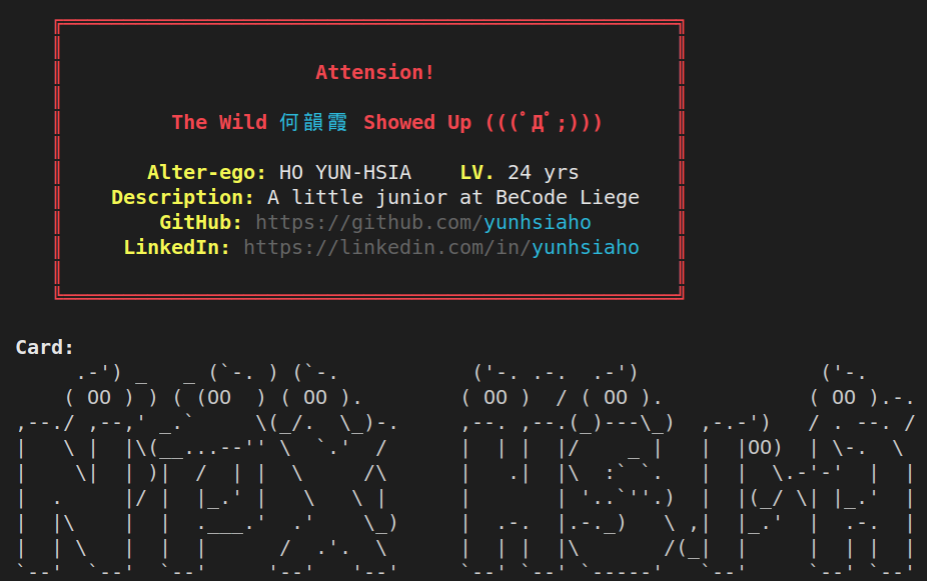

# hsia-npx-card
## Intro
It's a small project from Becode Liege in April 2021, to make a personal card shown in terminal.

## How to do it?
`npm i hsia-npx-card`

## How to use it
Type this command to get the card
`npx hsia`

## Want to see some result?
Nice to meet you~

## License
#### ISC